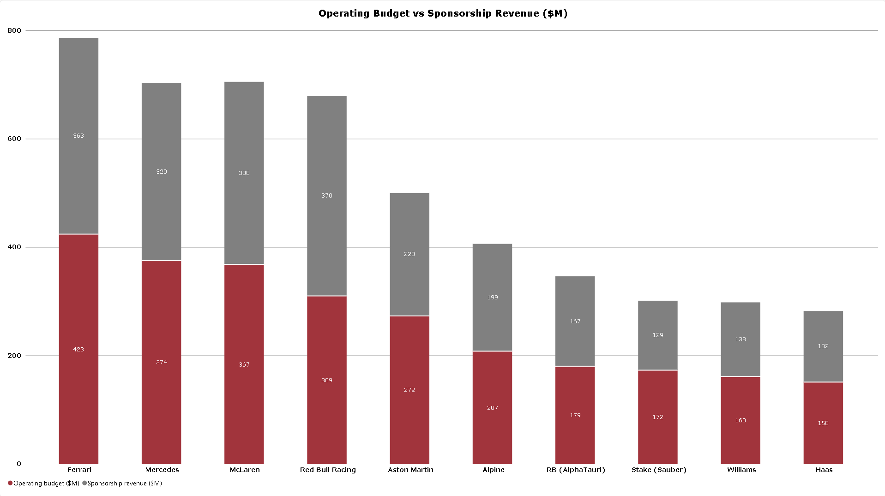

#Formula 1 Financial Performance & Efficiency Analytics

##Project Overview
This repository contains a comprehensive Power BI analytics solution evaluating the financial dynamics, investor return on investment (ROI), and spending efficiency across Formula 1 teams before and after the FIA budget cap regulations. 

The dashboard provides strategic financial insights by correlating team operating budgets, sponsorship revenue streams, and on-track championship performance.


##Dashboard Previews & Key Insights

### 1. Investor Return on Investment (ROI)
Evaluates the estimated operating return on capital investment across F1 constructors per season.


* **Market Leader:** **Red Bull Racing** dominates the grid with an exceptional **83.82% ROI**, nearly doubling the return of its closest competitors due to high championship efficiency relative to overall capital structure.
* **Midfield Efficiency:** **McLaren (46.87%)**, **RB / AlphaTauri (43.02%)**, and **Alpine (42.03%)** display balanced ROI metrics, maximizing commercial returns relative to operational outlays.
* **Capital Heavy Teams:** Legacy teams like **Ferrari (27.19%)** and **Mercedes (31.55%)** show lower percentage returns due to significantly higher structural operating costs.


### 2. Operating Budget vs. Sponsorship Revenue ($M)
Compares total team operational spending against secured commercial sponsorship revenue.



* **Top Budget Spenders:** **Ferrari ($423M budget / $363M sponsorship)** and **Mercedes ($374M budget / $329M sponsorship)** operate at the highest capital volume.
* **Commercial Surplus:** **Red Bull Racing** generates **$370M** in sponsorship revenue against an operating budget of **$309M**, highlighting strong commercial profitability.
* **Resource Constraints:** **Haas ($150M budget)** and **Williams ($160M budget)** operate near the lower threshold of team budgets, relying heavily on localized commercial partnerships.


### 3. Financial Efficiency: Cost per Championship Point ($M / Pt)
Measures capital efficiency by analyzing operating expenditure against championship points scored *(lower values indicate higher spending efficiency)*.


* **Most Efficient:** **Haas ($0.17M/Pt)** and **Williams ($0.19M/Pt)** lead in cost-per-point efficiency, demonstrating high resource optimization for midfield points scored.
* **Top-Tier Benchmark:** **Red Bull Racing ($0.36M/Pt)** achieves optimal spending efficiency among top championship contenders.
* **High Cost per Point:** **Ferrari ($0.49M/Pt)**, **Mercedes ($0.43M/Pt)**, and **McLaren ($0.43M/Pt)** show a higher cost-per-point ratio due to heavy capital investment in development cycles.


##Data Sources & Acknowledgments
The datasets used to construct this analysis were aggregated and synthesized from public data repositories and financial research:

* **Performance & Standings Data:** Sourced from public [Kaggle](https://www.kaggle.com/) Formula 1 datasets (historical standings, points scored, and team performance metrics).
* **Financial & Sponsorship Data:** Compiled from team financial disclosures, public FIA cost cap estimates, and industry publications (*e.g., Forbes, RaceFans, Motorsport.com*).


##Tech Stack & Architecture

* **Analytics & Visualization:** Microsoft Power BI Desktop
* **ETL & Data Transformation:** Power Query (Data cleaning, type casting, custom attributes)
* **Data Modeling:** Star Schema architecture connecting Financial Fact Tables with Teams and Season Dimensions.
* **DAX Formulas Applied:** Custom measure utilizing variables for robust seasonal aggregation:
  ```dax
  Cost_per_Point = 
  VAR TotalBudget = SUM(constructor_finances[operating_budget_usd_m])
  VAR TotalPoints = MAX(constructor_standings[points])
  RETURN
  DIVIDE(TotalBudget, TotalPoints, BLANK())


##Interactive Exploration
To interact with slicers, tooltips, and dynamic season filtering:
1. Clone or download this repository.
2. Open the `.pbix` file using **Power BI Desktop**.
