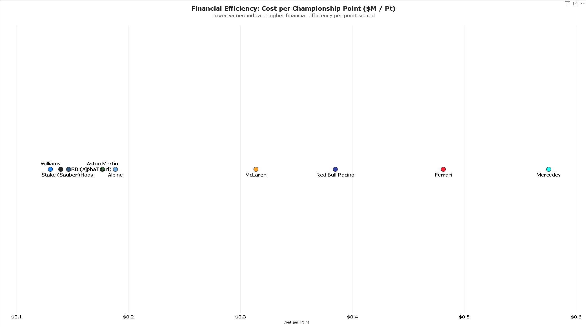
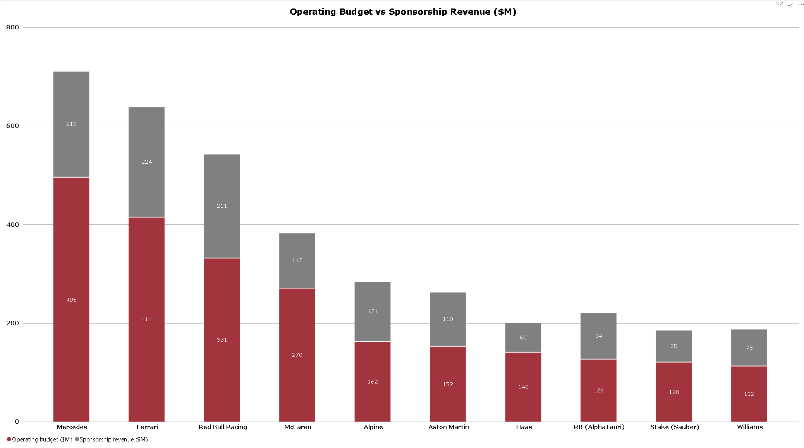

**Financial Performance and Return on Investment (ROI) Analysis of Formula 1 Constructors**

A Comparative Evaluation of 2019 and 2025

*Executive Summary*

This report analyzed the financial structures of Formula 1 constructors comparing the pre cost cap season of 2019 with the new regulatory environment of 2025. By analyzing key performance metrics like operational budgets, revenue streams of commercialization and sponsorship, through to metrics of cost per point and the resulting net investor return on investment, it highlights the changing landscape of financial sustainability and capital efficiency within F1 over a period of characterized by massive strategic restructuring.

**1. Pre-Cost Cap Financial Disparity and ROI (2019)**


In 2019, before the Capped Costs were applied, teams were able to spend all the money they wanted on developing the cars to be the most competitive on the grid. Making half of the teams of the grid to end the seasons with negative ROI as we can see **Mercedes** with a **-20.61%** or **McLaren** with a **-22.59%**.

This means that the team's total operational costs and investments exceeded the total revenue they brought in, resulting in a huge financial loss relative to their spending.

The same way we can see that the top tier teams had to spend a lot more money to get a single point on the championship, generating more disparity with the rest of the teams as we can see in the 
Cost per Championship Point graph.



**2. Operating Budgets vs Commercial Inflows (2019)**

Before the cost cap was introduced, the financial gap between front runners and the rest of the grid was heavily driven by uncapped operational spending.

As the Operating Budget versus Sponsorship Revenue breakdown illustrates, teams like Mercedes and Ferrari operated with massive budgets reaching up to **$495M** and **$414M** respectively, relying heavily on substantial financial commitments to chase performance.



While high sponsorship revenues cushioned some of these costs, the lack of spending restrictions meant that overall investment frequently outpaced earnings, establishing a volatile and financially unsustainable model across much of the grid prior to modern regulatory reforms.

**3. Post Cost Cap Transformation and ROI (2025)**

When financial regulations came into force, Formula 1's economic landscape went through a dramatic overhaul.
The sport imposed strict caps on how much teams could spend developing their cars roughly $140 million per year while still allowing flexibility for other operational costs, and this shift fundamentally changed the financial health of every team on the grid.

As seen in the 2025 Investor ROI data, every team transitioned from widespread deficits to high-yielding profitability. **Red Bull Racing** for example, has achieved an outstanding ROI of **83.82%**.


This amazing result alongside all the others like **McLaren**, **AlphaTauri**. **Alpine** and **Haas** being higher than **40%**. Shows to worldwide investors that this business is nowadays profitable. And also to the F1 teams, that they can achieve strong financial and sporting results without the need of investing hundreds of millions dollars.

**4. Strategic Takeaways and Industry Outlook**

As shown by the breakdown of the 2025 Operating Budget and Sponsorship Revenues, the modern regulatory system balanced the economic system of Formula 1.


Valuation of Sustainable Enterprises: Formula 1 has converted teams in high-value running and self-sustained sports assets due to keeping constructors from excessive costs of performance development and increasing value of sponsorship and global commercialization.

Capital Efficiency: Teams from the entire grid have the chance to succeed both financially and sporting-wise if they adopt the right strategy of economic activities.

Future Sustainability: The ultimate achievement of the transition from a cash flow negative arms race to a firmly regulated financial system is the possibility of long-term economic stability of Formula 1 business practices.


*Data Sources & Acknowledgments*

The datasets used to construct this analysis were aggregated and synthesized from public data repositories and financial research:

* **Performance & Standings Data:** Sourced from public [Kaggle](https://www.kaggle.com/) Formula 1 datasets (historical standings, points scored, and team performance metrics).
* **Financial & Sponsorship Data:** Compiled from team financial disclosures, public FIA cost cap estimates, and industry publications (*e.g., Forbes, RaceFans, Motorsport.com*).


*Tech Stack & Architecture*

* **Analytics & Visualization:** Microsoft Power BI Desktop
* **ETL & Data Transformation:** Power Query (Data cleaning, type casting, custom attributes)
* **Data Modeling:** Star Schema architecture connecting Financial Fact Tables with Teams and Season Dimensions.
* **DAX Formulas Applied:** Custom measure utilizing variables for robust seasonal aggregation:
  ```dax
  Cost_per_Point = 
  VAR TotalBudget = SUM(constructor_finances[operating_budget_usd_m])
  VAR TotalPoints = MAX(constructor_standings[points])
  RETURN
  DIVIDE(TotalBudget, TotalPoints, BLANK())


Interactive Exploration
To interact with slicers, tooltips, and dynamic season filtering:
1. Clone or download this repository.
2. Open the `.pbix` file using **Power BI Desktop**.
