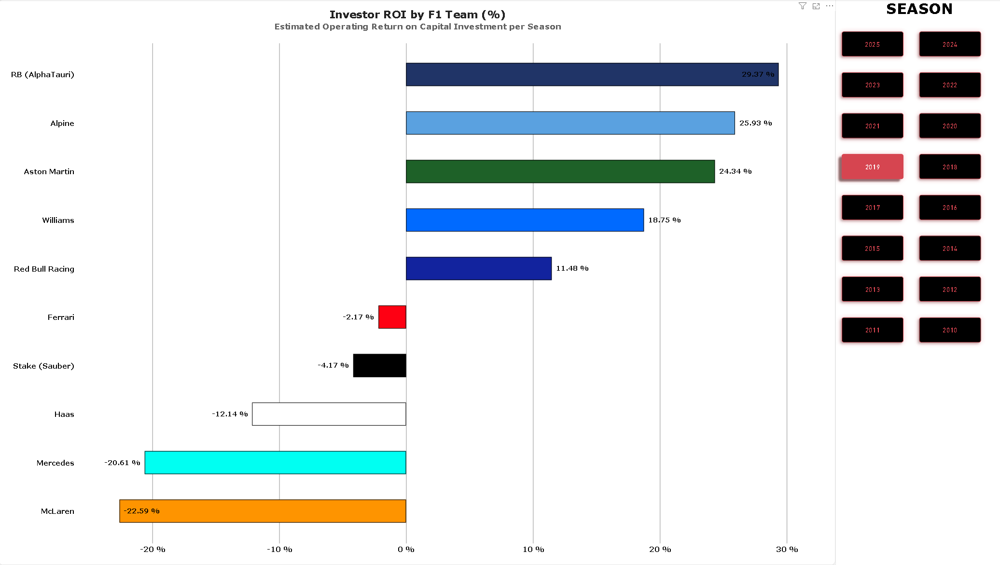

**Financial Performance and Return on Investment (ROI) Analysis of Formula 1 Constructors**
A Comparative Evaluation of 2019 and 2025

*Executive Summary*

This report analyzed the financial structures of Formula 1 constructors comparing the pre cost cap season of 2019 with the new regulatory environment of 2025. By analyzing key performance metrics like operational budgets, revenue streams of commercialization and sponsorship, through to metrics of cost per point and the resulting net investor return on investment, it highlights the changing landscape of financial sustainability and capital efficiency within F1 over a period of characterized by massive strategic restructuring.

1. Investor Return on Investment (ROI)



In 2019, before the Capped Costs where applied, teams were able to spend all the money they wanted on developing the cars to be the most competitive on the grid. Making half of the teams of the grid to end the seasons with negative ROI as we can see **Mercedes** with a **-20.61%** or **McLaren** with a **-22.59%**. This means that the team's total operational costs and investments exceeded the total revenue they brought in, resulting in a huge financial loss relative to their spending. The same way we can see that the top tier teams had to spend a lot more money to get a single point on the champoinship, generating more disparity with the rest of the teams as we can see in the 
Cost per Championship Point graph.


As shown in this screen shot when the year 2025 is selected, **Red Bull Racing** is the most profitable team on the grid, with a **83.82%**. Almost doubling **McLaren** which is the second one with a **46.87%**.

But why is this happening, how can it be possible for one brand to be this far away from their competitors?

This is due to the Capped Costs that limits how much money they are allowed to spend (arround $140M) on developing the car. And to the massive revenue they get from their sponsorships, merchandise and championship prize money. If we take a look at the Operating Budget vs Sponsorship Revenue graph, we can see that **Red Bull Racing** is the only team on the greed that has more Sponsorship Revenue than Operating Budget.


All this is after the FIA budget cap rules, but what happens if we go back to 2019 before those rules?


If we take a look at this bar chart, we can see that half of the teams of the f1 grid were not profitable.
What we can take from here is that, the teams that spend the most money on developing the car might not be always the most profitable ones, because when you spend over 500M dollars on developing the car (as mercedes did that year) not even winning the championship retourns you all the investment you have made.


2. Operating Budget vs. Sponsorship Revenue ($M)
Analyses the total team operational expenses against commercial sponsorship revenue.


* **Highest Budget Spenders:** The highest operating budgets are demonstrated by **Ferrari ($423M budget / $363M sponsorship)** and **Mercedes ($374M budget / $329M sponsorship)**.
* **Commercial Profitability:** **Red Bull Racing** produces **$370M** worth of sponsorship revenues against its operating budget of **$309M**.
* **Resource Limited:** **Haas ($150M budget)** and **Williams ($160M budget)** work with lower threshold of team budgets, relying heavily on local commercial sponsorships.

3. Financial Efficiency: Cost per Championship Point ($M / Pt)
Measuring capital efficiency using the analysis of operating budget against championship points score *(the lower number shows higher spending efficiency)*.


* **Best Spending Efficiency:** **Haas ($0.17M/Pt)** and **Williams ($0.19M/Pt)** have the best cost-per-point spending efficiency numbers.
* **Best-in-Class:** **Red Bull Racing ($0.36M/Pt)** demonstrates optimal spending efficiency among top championship competitors.
* **Spending Efficiency:** **Ferrari ($0.49M/Pt)**, **Mercedes ($0.43M/Pt)** and **McLaren ($0.43M/Pt)** are demonstrating high cost-per-point ratio due to their capital expenditures in development cycles.


*Data Sources & Acknowledgments*

The datasets used to construct this analysis were aggregated and synthesized from public data repositories and financial research:

* **Performance & Standings Data:** Sourced from public [Kaggle](https://www.kaggle.com/) Formula 1 datasets (historical standings, points scored, and team performance metrics).
* **Financial & Sponsorship Data:** Compiled from team financial disclosures, public FIA cost cap estimates, and industry publications (*e.g., Forbes, RaceFans, Motorsport.com*).


*Tech Stack & Architecture*

* **Analytics & Visualization:** Microsoft Power BI Desktop
* **ETL & Data Transformation:** Power Query (Data cleaning, type casting, custom attributes)
* **Data Modeling:** Star Schema architecture connecting Financial Fact Tables with Teams and Season Dimensions.
* **DAX Formulas Applied:** Custom measure utilizing variables for robust seasonal aggregation:
  ```dax
  Cost_per_Point = 
  VAR TotalBudget = SUM(constructor_finances[operating_budget_usd_m])
  VAR TotalPoints = MAX(constructor_standings[points])
  RETURN
  DIVIDE(TotalBudget, TotalPoints, BLANK())


Interactive Exploration
To interact with slicers, tooltips, and dynamic season filtering:
1. Clone or download this repository.
2. Open the `.pbix` file using **Power BI Desktop**.
