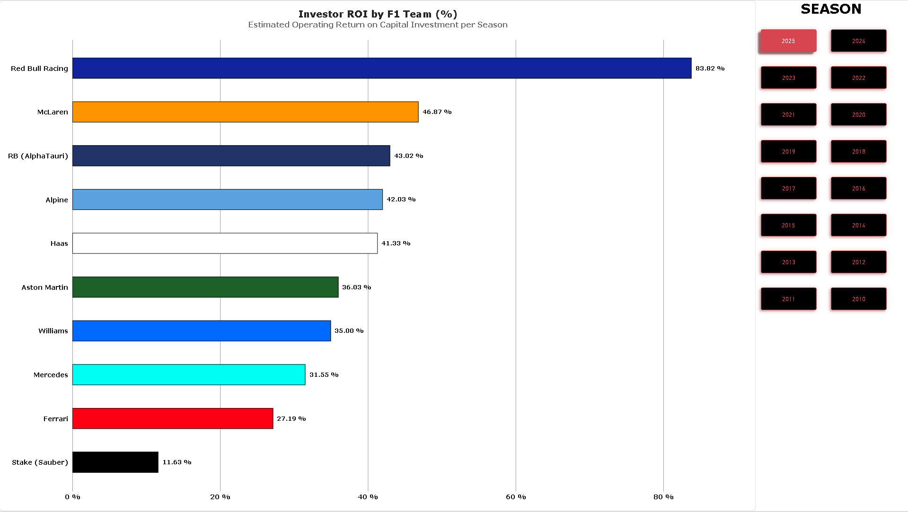
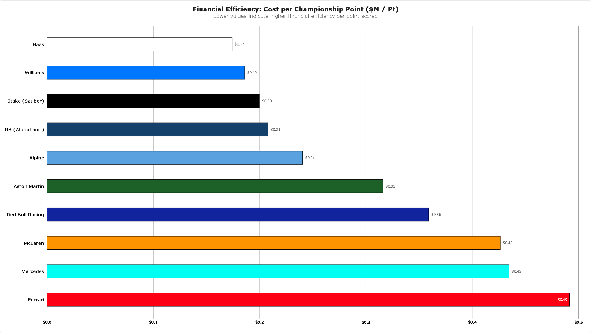

#Formula 1 Financial Performance & Efficiency Analytics

##Project Overview
This GitHub repository is home to a complete Power BI dashboard solution that analyzes financial dynamics, investor return on investment (ROI) and spending efficiency of Formula 1 teams before and after FIA budget cap rules.

The dashboard helps analyze financial dynamics by establishing correlation between team operating budgets, sponsorship revenue sources, and race championship performances of the teams.


##Dashboards Preview & Insights

### 1. Investor Return on Investment (ROI)
Analyzes estimated operating return on investment across F1 constructors per season.



* **Market Leader:** The grid leader is **Red Bull Racing**, showing outstanding **83.82% ROI**, twice as high as that of any of its rivals due to the highest championship efficiency compared to its capital structure.
* **Midfield Efficiency:** **McLaren (46.87%)**, **RB / AlphaTauri (43.02%)** and **Alpine (42.03%)** demonstrate balanced return on investment metrics, achieving maximum commercial efficiency in relation to operational expenses.
* **Heavy Capital Teams:** The legacy teams such as **Ferrari (27.19%)** and **Mercedes (31.55%)** are demonstrating lower percentage returns due to their significantly higher operating structural costs.


### 2. Operating Budget vs. Sponsorship Revenue ($M)
Analyses the total team operational expenses against commercial sponsorship revenue.


* **Highest Budget Spenders:** The highest operating budgets are demonstrated by **Ferrari ($423M budget / $363M sponsorship)** and **Mercedes ($374M budget / $329M sponsorship)**.
* **Commercial Profitability:** **Red Bull Racing** produces **$370M** worth of sponsorship revenues against its operating budget of **$309M**.
* **Resource Limited:** **Haas ($150M budget)** and **Williams ($160M budget)** work with lower threshold of team budgets, relying heavily on local commercial sponsorships.


### 3. Financial Efficiency: Cost per Championship Point ($M / Pt)
Measuring capital efficiency using the analysis of operating budget against championship points score *(the lower number shows higher spending efficiency)*.



* **Best Spending Efficiency:** **Haas ($0.17M/Pt)** and **Williams ($0.19M/Pt)** have the best cost-per-point spending efficiency numbers.
* **Best-in-Class:** **Red Bull Racing ($0.36M/Pt)** demonstrates optimal spending efficiency among top championship competitors.
* **Spending Efficiency:** **Ferrari ($0.49M/Pt)**, **Mercedes ($0.43M/Pt)** and **McLaren ($0.43M/Pt)** are demonstrating high cost-per-point ratio due to their capital expenditures in development cycles.


##Data Sources & Acknowledgments
The datasets used to construct this analysis were aggregated and synthesized from public data repositories and financial research:

* **Performance & Standings Data:** Sourced from public [Kaggle](https://www.kaggle.com/) Formula 1 datasets (historical standings, points scored, and team performance metrics).
* **Financial & Sponsorship Data:** Compiled from team financial disclosures, public FIA cost cap estimates, and industry publications (*e.g., Forbes, RaceFans, Motorsport.com*).


##Tech Stack & Architecture

* **Analytics & Visualization:** Microsoft Power BI Desktop
* **ETL & Data Transformation:** Power Query (Data cleaning, type casting, custom attributes)
* **Data Modeling:** Star Schema architecture connecting Financial Fact Tables with Teams and Season Dimensions.
* **DAX Formulas Applied:** Custom measure utilizing variables for robust seasonal aggregation:
  ```dax
  Cost_per_Point = 
  VAR TotalBudget = SUM(constructor_finances[operating_budget_usd_m])
  VAR TotalPoints = MAX(constructor_standings[points])
  RETURN
  DIVIDE(TotalBudget, TotalPoints, BLANK())


##Interactive Exploration
To interact with slicers, tooltips, and dynamic season filtering:
1. Clone or download this repository.
2. Open the `.pbix` file using **Power BI Desktop**.
